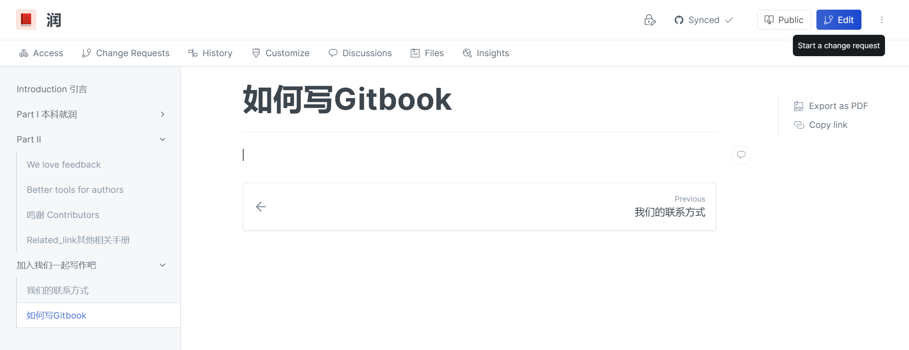

## Step1 联系我们

将你的github注册邮箱发给我们，然后

1，我们将邀请你进入我们的orgnization的team，让你获得我们github中，github orgnization里repositories的修改权限

2，或者我们邀请你进入我们gitbook的team中，获得我们项目的修改权限

## Step2 开始写作
在获得了修改权限后，最直接的 你可以直接点击Edit 在https://app.gitbook.com/ 中直接编辑我们的gitbook，当然，你的编辑记录我们都可以看见
