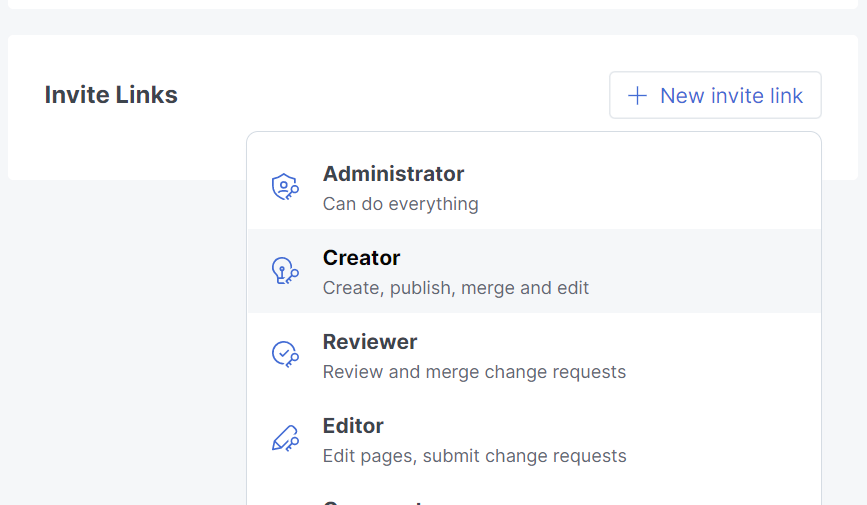

# 如何写Gitbook

### Step1 联系我们

将你的github注册邮箱发给我们，然后

1，我们将邀请你进入我们的orgnization的team，让你获得我们github中，github orgnization里repositories的修改权限

2，或者我们邀请你进入我们gitbook的team中，获得我们项目的修改权限

### Step2 开始写作

1,在获得了修改权限后，最直接的 你可以直接点击Edit 在https://app.gitbook.com/ 中直接编辑我们的gitbook，当然，你的编辑记录我们都可以看见

2,或者你在github中直接编辑markdown格式文件

但是要注意，在相应文件夹下写完markdwon文档后

一定要在summary.md中修改目录，这样gitbook才能自动将你新加入的markdown文件加入目录中

至于怎么写markdown文件、怎么在markdown中加入链接我相信聪明的你肯定能自学

3，另外需要注意的是，在插入图片时，尽量选择在gitbook界面插入，因为你在本地markdown中即使调整了图片的大小，在gitbook中还是统一的格式，这个格式有点小且别扭。在gitbook中插入图片可以更大一些(虽然也很别扭...

4, 其他写作方法，比如在本地写好然后git add .   ; git commit -m    "" ;git push origin HEAD:main 这些操作就比较需要熟悉git了 可以自己学习一下哦
